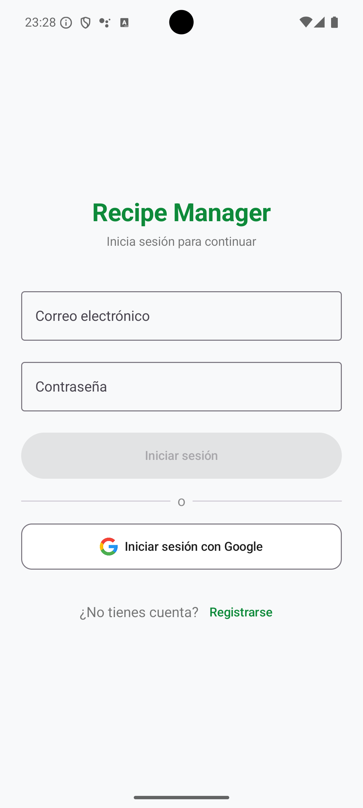
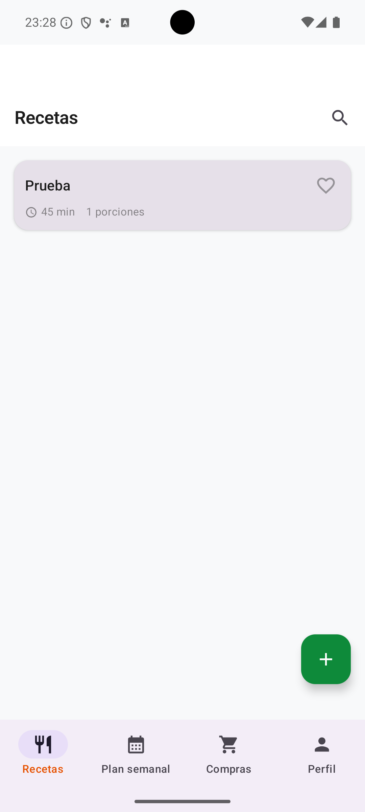
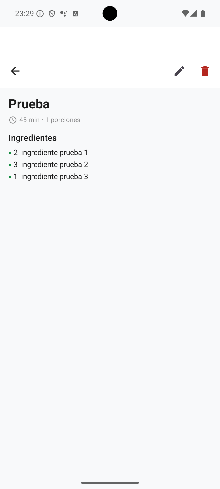
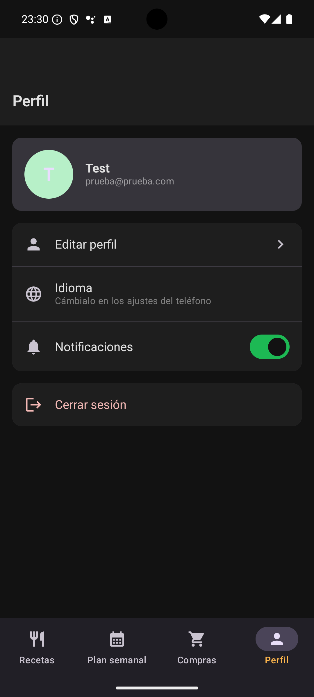
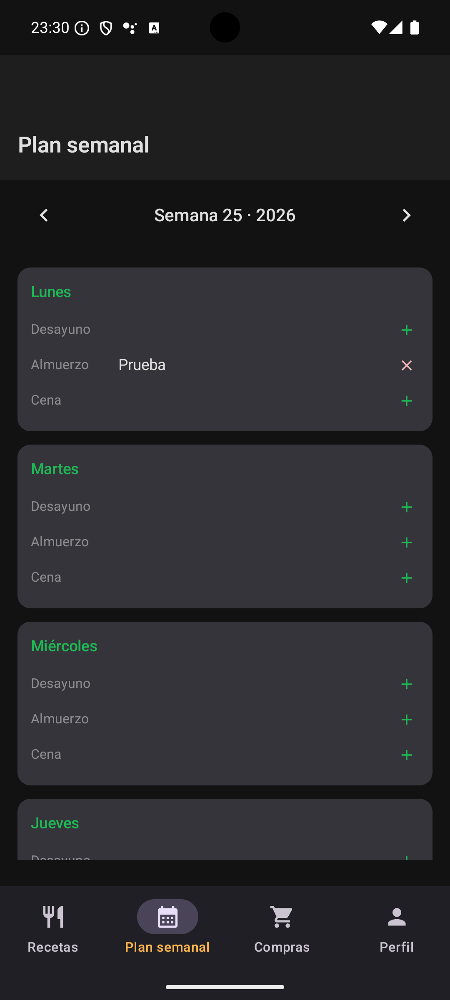
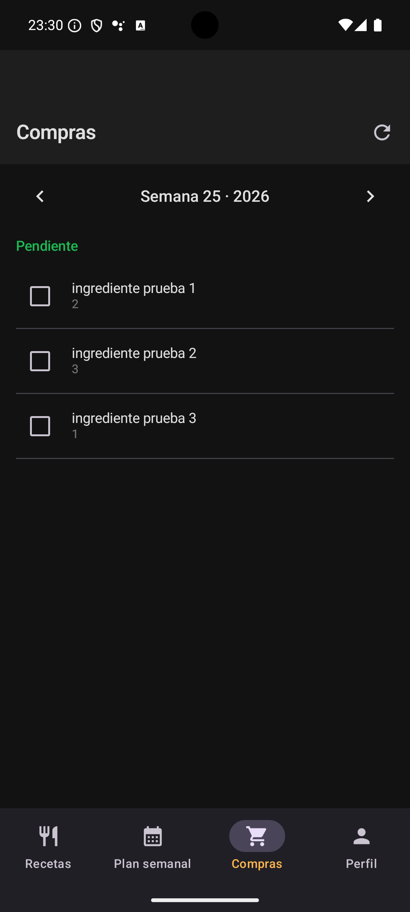

# Recipe Manager

An Android recipe and meal planning app built as part of the [CastroDev](https://castrodev.com) portfolio. Create and manage your own recipes, plan your weekly meals, and generate automatic shopping lists — with TheMealDB integration to import thousands of external recipes.

---

## 📱 Screenshots

<p align="center">
  
  
  
  
</p>
<p align="center">
  
  
</p>

---

## ✨ Features

- 🍽️ **Recipes** — Create and manage recipes with ingredients, steps, prep/cook time and servings
- ✏️ **Edit recipes** — Update name, ingredients and steps at any time
- 🔍 **External search** — Search and import recipes from [TheMealDB](https://www.themealdb.com) (no API key required)
- ❤️ **Favourites** — Mark recipes as favourites for quick access
- 📅 **Weekly meal planner** — Assign breakfast, lunch and dinner to each day of the week
- 🛒 **Shopping list** — Auto-generated from the weekly meal plan; tap the refresh icon to regenerate after editing recipes
- ✅ **Check off items** — Mark ingredients as purchased while shopping
- 🌙 **Dark mode** — Automatic dark/light mode based on system settings
- 👤 **Profile** — Edit name, manage notifications; language follows system settings
- 🌍 **Multilingual** — English and Spanish support

> **Note:** The shopping list is generated from the current ingredients of each recipe in the meal plan. If you edit a recipe's ingredients, tap the refresh icon in the Shopping tab to regenerate the list with the updated data.

---

## 🛠️ Tech Stack

| Layer | Technology |
|---|---|
| Language | Kotlin |
| UI Framework | Jetpack Compose |
| State Management | ViewModel + StateFlow |
| Authentication | Firebase Auth (Email + Google) |
| Backend | .NET 10 REST API (Clean Architecture) |
| Database | Cloud Firestore |
| External API | TheMealDB (free, no API key) |
| Networking | Retrofit + OkHttp |
| Image Loading | Coil |
| Infrastructure | Google Cloud Run |

---

## 🏗️ Architecture

The app follows **Clean Architecture** principles with strict layer separation:

```
recipemanager/
├── core/
│   ├── network/       # API client, token provider, interceptor
│   └── theme/         # Colors, typography, Material3 theme
├── features/
│   ├── auth/          # Login, register, Google Sign-In
│   ├── recipes/       # CRUD recipes, external search & import
│   ├── mealplan/      # Weekly meal planner
│   ├── shopping/      # Shopping list generation & management
│   └── profile/       # User profile & settings
└── navigation/        # App navigation & bottom tabs
```

Each feature follows the pattern:

```
Feature/
├── data/
│   ├── datasource/    # Retrofit API service & remote data source
│   ├── model/         # DTO models & request/response
│   └── repository/    # Repository implementations
├── domain/
│   ├── entity/        # Domain entities
│   ├── repository/    # Abstract repository interfaces
│   └── usecase/       # Business logic use cases
└── presentation/
    ├── screen/        # Composable screens
    ├── viewmodel/     # ViewModels with StateFlow
    └── components/    # Reusable UI components
```

---

## 🚀 Getting Started

### Prerequisites

- Android Studio Hedgehog or later
- Android SDK 26+
- Firebase project configured
- API running at `api.castrodev.com` or locally

### Installation

```bash
# Clone the repository
git clone https://github.com/castrodev/recipe-manager-android.git

# Open in Android Studio
```

Then:

1. Add your `google-services.json` to the `app/` folder
2. Sync Gradle dependencies
3. Build and run with the Run button or `Shift + F10`

### Running Tests

```bash
./gradlew test
./gradlew connectedAndroidTest
```

---

## 🔗 Related

- [CastroDev API](https://github.com/castrodev/castrodev-api) — Shared .NET 10 backend
- [Finance Tracker](https://github.com/castrodev/finance-tracker) — Personal finance app (Flutter)
- [Habit Tracker](https://github.com/castrodev/habit-tracker) — Daily habit tracking app (Flutter)
- [Task Manager](https://github.com/castrodev/task-manager-ios) — Board-based task management (iOS)
- [Budget Scanner](https://github.com/castrodev/budget-scanner-ios) — Budget & expense tracking (iOS)
- [castrodev.com](https://castrodev.com) — Portfolio

---

## 📄 License

MIT © [Gabriel Castro](https://castrodev.com)

---

---

# Recipe Manager

App Android de gestión de recetas y planificación de comidas desarrollada como parte del portfolio de [CastroDev](https://castrodev.com). Crea y gestiona tus propias recetas, planifica tus comidas semanales y genera listas de la compra automáticas — con integración con TheMealDB para importar miles de recetas externas.

---

## ✨ Funcionalidades

- 🍽️ **Recetas** — Crea y gestiona recetas con ingredientes, pasos, tiempo de preparación y porciones
- ✏️ **Editar recetas** — Actualiza nombre, ingredientes y pasos en cualquier momento
- 🔍 **Búsqueda externa** — Busca e importa recetas de [TheMealDB](https://www.themealdb.com) (sin API key)
- ❤️ **Favoritos** — Marca recetas como favoritas para acceso rápido
- 📅 **Plan semanal** — Asigna desayuno, almuerzo y cena a cada día de la semana
- 🛒 **Lista de la compra** — Generada automáticamente desde el plan semanal; pulsa el icono de actualizar para regenerarla tras editar recetas
- ✅ **Marcar ingredientes** — Marca los ingredientes como comprados mientras haces la compra
- 🌙 **Modo oscuro** — Modo oscuro/claro automático según la configuración del sistema
- 👤 **Perfil** — Edita tu nombre y gestiona notificaciones; el idioma sigue los ajustes del sistema
- 🌍 **Multiidioma** — Soporte para español e inglés

> **Nota:** La lista de la compra se genera a partir de los ingredientes actuales de cada receta del plan. Si editas los ingredientes de una receta, pulsa el icono de actualizar en la pestaña Compras para regenerar la lista con los datos actualizados.

---

## 🛠️ Stack Tecnológico

| Capa | Tecnología |
|---|---|
| Lenguaje | Kotlin |
| UI Framework | Jetpack Compose |
| Estado | ViewModel + StateFlow |
| Autenticación | Firebase Auth (Email + Google) |
| Backend | API REST .NET 10 (Clean Architecture) |
| Base de datos | Cloud Firestore |
| API Externa | TheMealDB (gratuita, sin API key) |
| Red | Retrofit + OkHttp |
| Imágenes | Coil |
| Infraestructura | Google Cloud Run |

---

## 🚀 Instalación

### Requisitos previos

- Android Studio Hedgehog o posterior
- Android SDK 26+
- Proyecto Firebase configurado
- API disponible en `api.castrodev.com` o en local

### Pasos

```bash
# Clonar el repositorio
git clone https://github.com/castrodev/recipe-manager-android.git

# Abrir en Android Studio
```

A continuación:

1. Añade tu `google-services.json` a la carpeta `app/`
2. Sincroniza las dependencias de Gradle
3. Compila y ejecuta con el botón Run o `Shift + F10`

### Tests

```bash
./gradlew test
./gradlew connectedAndroidTest
```

---

## 🔗 Relacionado

- [CastroDev API](https://github.com/castrodev/castrodev-api) — Backend compartido en .NET 10
- [Finance Tracker](https://github.com/castrodev/finance-tracker) — App de finanzas personales (Flutter)
- [Habit Tracker](https://github.com/castrodev/habit-tracker) — App de seguimiento de hábitos (Flutter)
- [Task Manager](https://github.com/castrodev/task-manager-ios) — Gestión de tareas por tableros (iOS)
- [Budget Scanner](https://github.com/castrodev/budget-scanner-ios) — Seguimiento de presupuestos (iOS)
- [castrodev.com](https://castrodev.com) — Portfolio

---

## 📄 Licencia

MIT © [Gabriel Castro](https://castrodev.com)